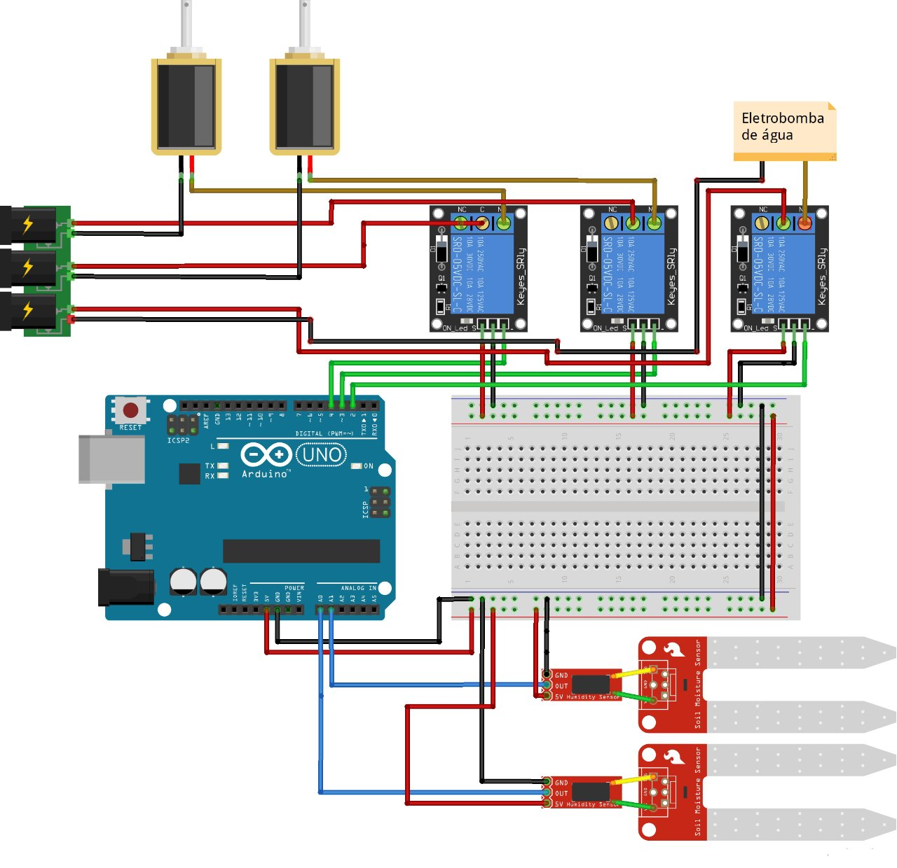

# Automatic Watering System

The system uses an Arduino board to measure soil moisture, calculate the ideal dryness for watering and, finally, if necessary, water the soil, repeating the cycle.

The project also uses a cistern with a water level sensor as a water source, which can be adapted to other sources.

## This project

This circuit was made for an institutional science presentation at Instituto Federal Catarinense. It was builded using:

- 1x Arduino Uno board;
- 2x Soil moisture sensors;
- 1x Water level sensor;
- 3x Arduino relay modules;
- 1x Water Pump
- 2x Solenoid Valve
- Some pipes and wires;

The water pump is an additional to fill the cistern when it is low. The more different parts of the soil you want to irrigate, the more valves and sensors you will need (in this case were two for both).

This is the diagram of the circuit:

It was programmed using C++ apply to Arduino.

###### Vitor Matheus Valandro da Rosa. September 2019.
